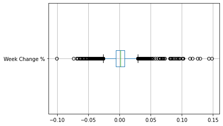
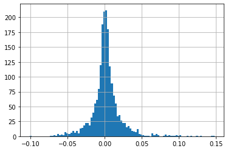
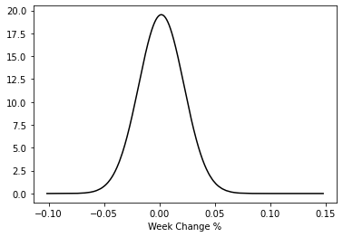

```python
import pandas as pd
from matplotlib import pyplot as plt
from scipy.stats import norm
import numpy as np
import seaborn as sb
```


```python
data = pd.read_csv('USD_GEL Historical Data.csv')
data
```


<div>
<style scoped>
    .dataframe tbody tr th:only-of-type {
        vertical-align: middle;
    }

    .dataframe tbody tr th {
        vertical-align: top;
    }

    .dataframe thead th {
        text-align: right;
    }
</style>
<table border="1" class="dataframe">
  <thead>
    <tr style="text-align: right;">
      <th></th>
      <th>Date</th>
      <th>Price</th>
      <th>Open</th>
      <th>High</th>
      <th>Low</th>
      <th>Change %</th>
    </tr>
  </thead>
  <tbody>
    <tr>
      <th>0</th>
      <td>Jul 01, 2022</td>
      <td>2.8700</td>
      <td>2.9375</td>
      <td>2.9400</td>
      <td>2.8700</td>
      <td>-1.71%</td>
    </tr>
    <tr>
      <th>1</th>
      <td>Jun 30, 2022</td>
      <td>2.9200</td>
      <td>2.9325</td>
      <td>2.9425</td>
      <td>2.9325</td>
      <td>0.17%</td>
    </tr>
    <tr>
      <th>2</th>
      <td>Jun 29, 2022</td>
      <td>2.9150</td>
      <td>2.9325</td>
      <td>2.9400</td>
      <td>2.9325</td>
      <td>-0.85%</td>
    </tr>
    <tr>
      <th>3</th>
      <td>Jun 28, 2022</td>
      <td>2.9400</td>
      <td>2.9275</td>
      <td>2.9402</td>
      <td>2.9275</td>
      <td>1.03%</td>
    </tr>
    <tr>
      <th>4</th>
      <td>Jun 27, 2022</td>
      <td>2.9100</td>
      <td>2.9275</td>
      <td>2.9427</td>
      <td>2.9260</td>
      <td>0.00%</td>
    </tr>
    <tr>
      <th>...</th>
      <td>...</td>
      <td>...</td>
      <td>...</td>
      <td>...</td>
      <td>...</td>
      <td>...</td>
    </tr>
    <tr>
      <th>1952</th>
      <td>Jan 07, 2015</td>
      <td>1.8929</td>
      <td>1.8929</td>
      <td>1.8929</td>
      <td>1.8929</td>
      <td>0.00%</td>
    </tr>
    <tr>
      <th>1953</th>
      <td>Jan 06, 2015</td>
      <td>1.8929</td>
      <td>1.8778</td>
      <td>1.8937</td>
      <td>1.8777</td>
      <td>0.81%</td>
    </tr>
    <tr>
      <th>1954</th>
      <td>Jan 05, 2015</td>
      <td>1.8777</td>
      <td>1.8787</td>
      <td>1.8787</td>
      <td>1.8777</td>
      <td>-0.27%</td>
    </tr>
    <tr>
      <th>1955</th>
      <td>Jan 02, 2015</td>
      <td>1.8827</td>
      <td>1.8827</td>
      <td>1.8827</td>
      <td>1.8827</td>
      <td>0.00%</td>
    </tr>
    <tr>
      <th>1956</th>
      <td>Jan 01, 2015</td>
      <td>1.8827</td>
      <td>1.8827</td>
      <td>1.8827</td>
      <td>1.8827</td>
      <td>0.00%</td>
    </tr>
  </tbody>
</table>
<p>1957 rows × 6 columns</p>
</div>


```python
for s in range(1950):
    data.loc[s, 'Week Change %'] = (data.loc[s, 'Price'] - data.loc[s + 7, 'Price']) / data.loc[s + 7, 'Price']
data
```


<div>
<style scoped>
    .dataframe tbody tr th:only-of-type {
        vertical-align: middle;
    }

    .dataframe tbody tr th {
        vertical-align: top;
    }

    .dataframe thead th {
        text-align: right;
    }
</style>
<table border="1" class="dataframe">
  <thead>
    <tr style="text-align: right;">
      <th></th>
      <th>Date</th>
      <th>Price</th>
      <th>Open</th>
      <th>High</th>
      <th>Low</th>
      <th>Change %</th>
      <th>Week Change %</th>
    </tr>
  </thead>
  <tbody>
    <tr>
      <th>0</th>
      <td>Jul 01, 2022</td>
      <td>2.8700</td>
      <td>2.9375</td>
      <td>2.9400</td>
      <td>2.8700</td>
      <td>-1.71%</td>
      <td>0.000000</td>
    </tr>
    <tr>
      <th>1</th>
      <td>Jun 30, 2022</td>
      <td>2.9200</td>
      <td>2.9325</td>
      <td>2.9425</td>
      <td>2.9325</td>
      <td>0.17%</td>
      <td>0.019197</td>
    </tr>
    <tr>
      <th>2</th>
      <td>Jun 29, 2022</td>
      <td>2.9150</td>
      <td>2.9325</td>
      <td>2.9400</td>
      <td>2.9325</td>
      <td>-0.85%</td>
      <td>0.015679</td>
    </tr>
    <tr>
      <th>3</th>
      <td>Jun 28, 2022</td>
      <td>2.9400</td>
      <td>2.9275</td>
      <td>2.9402</td>
      <td>2.9275</td>
      <td>1.03%</td>
      <td>0.018182</td>
    </tr>
    <tr>
      <th>4</th>
      <td>Jun 27, 2022</td>
      <td>2.9100</td>
      <td>2.9275</td>
      <td>2.9427</td>
      <td>2.9260</td>
      <td>0.00%</td>
      <td>0.010417</td>
    </tr>
    <tr>
      <th>...</th>
      <td>...</td>
      <td>...</td>
      <td>...</td>
      <td>...</td>
      <td>...</td>
      <td>...</td>
      <td>...</td>
    </tr>
    <tr>
      <th>1952</th>
      <td>Jan 07, 2015</td>
      <td>1.8929</td>
      <td>1.8929</td>
      <td>1.8929</td>
      <td>1.8929</td>
      <td>0.00%</td>
      <td>NaN</td>
    </tr>
    <tr>
      <th>1953</th>
      <td>Jan 06, 2015</td>
      <td>1.8929</td>
      <td>1.8778</td>
      <td>1.8937</td>
      <td>1.8777</td>
      <td>0.81%</td>
      <td>NaN</td>
    </tr>
    <tr>
      <th>1954</th>
      <td>Jan 05, 2015</td>
      <td>1.8777</td>
      <td>1.8787</td>
      <td>1.8787</td>
      <td>1.8777</td>
      <td>-0.27%</td>
      <td>NaN</td>
    </tr>
    <tr>
      <th>1955</th>
      <td>Jan 02, 2015</td>
      <td>1.8827</td>
      <td>1.8827</td>
      <td>1.8827</td>
      <td>1.8827</td>
      <td>0.00%</td>
      <td>NaN</td>
    </tr>
    <tr>
      <th>1956</th>
      <td>Jan 01, 2015</td>
      <td>1.8827</td>
      <td>1.8827</td>
      <td>1.8827</td>
      <td>1.8827</td>
      <td>0.00%</td>
      <td>NaN</td>
    </tr>
  </tbody>
</table>
<p>1957 rows × 7 columns</p>
</div>


```python
data['Week Change %'].std()
```


    0.020416688084545723


```python
data['Week Change %'].mean()
```


    0.00175403167829579


```python
data.boxplot('Week Change %', vert = False);
```


    

    


```python
data['Week Change %'].hist(bins = 100);
```


    

    


```python
pdf = norm.pdf(data['Week Change %'], loc = data['Week Change %'].mean() , scale = data['Week Change %'].std())
sb.lineplot(data['Week Change %'], pdf , color = 'black');
```

    C:\Users\79110\anaconda3\lib\site-packages\seaborn\_decorators.py:36: FutureWarning: Pass the following variables as keyword args: x, y. From version 0.12, the only valid positional argument will be `data`, and passing other arguments without an explicit keyword will result in an error or misinterpretation.
      warnings.warn(
    


    

    


```python
p = - 0.03
prob = norm(loc = data['Week Change %'].mean() , scale = data['Week Change %'].std()).cdf(p) # - norm(loc = data['Week Change %'].mean() , scale = data['Week Change %'].std()).cdf(-p)
print(prob)
```

    0.05993757111338306
    
