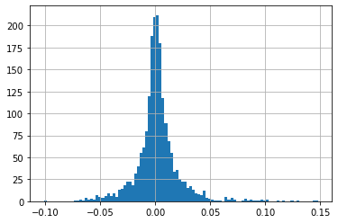

# Study of the probability of a change in the exchange rate of the dollar against the Georgian lari

Loading the required libraries


```python
import pandas as pd
from matplotlib import pyplot as plt
from scipy.stats import norm
import numpy as np
import seaborn as sb
```

Download the history of exchange rate changes since 2015. Source https://www.investing.com/


```python
data = pd.read_csv('USD_GEL Historical Data.csv')
data
```


<div>
<style scoped>
    .dataframe tbody tr th:only-of-type {
        vertical-align: middle;
    }

    .dataframe tbody tr th {
        vertical-align: top;
    }

    .dataframe thead th {
        text-align: right;
    }
</style>
<table border="1" class="dataframe">
  <thead>
    <tr style="text-align: right;">
      <th></th>
      <th>Date</th>
      <th>Price</th>
      <th>Open</th>
      <th>High</th>
      <th>Low</th>
      <th>Change %</th>
    </tr>
  </thead>
  <tbody>
    <tr>
      <th>0</th>
      <td>Jul 01, 2022</td>
      <td>2.8700</td>
      <td>2.9375</td>
      <td>2.9400</td>
      <td>2.8700</td>
      <td>-1.71%</td>
    </tr>
    <tr>
      <th>1</th>
      <td>Jun 30, 2022</td>
      <td>2.9200</td>
      <td>2.9325</td>
      <td>2.9425</td>
      <td>2.9325</td>
      <td>0.17%</td>
    </tr>
    <tr>
      <th>2</th>
      <td>Jun 29, 2022</td>
      <td>2.9150</td>
      <td>2.9325</td>
      <td>2.9400</td>
      <td>2.9325</td>
      <td>-0.85%</td>
    </tr>
    <tr>
      <th>3</th>
      <td>Jun 28, 2022</td>
      <td>2.9400</td>
      <td>2.9275</td>
      <td>2.9402</td>
      <td>2.9275</td>
      <td>1.03%</td>
    </tr>
    <tr>
      <th>4</th>
      <td>Jun 27, 2022</td>
      <td>2.9100</td>
      <td>2.9275</td>
      <td>2.9427</td>
      <td>2.9260</td>
      <td>0.00%</td>
    </tr>
    <tr>
      <th>...</th>
      <td>...</td>
      <td>...</td>
      <td>...</td>
      <td>...</td>
      <td>...</td>
      <td>...</td>
    </tr>
    <tr>
      <th>1952</th>
      <td>Jan 07, 2015</td>
      <td>1.8929</td>
      <td>1.8929</td>
      <td>1.8929</td>
      <td>1.8929</td>
      <td>0.00%</td>
    </tr>
    <tr>
      <th>1953</th>
      <td>Jan 06, 2015</td>
      <td>1.8929</td>
      <td>1.8778</td>
      <td>1.8937</td>
      <td>1.8777</td>
      <td>0.81%</td>
    </tr>
    <tr>
      <th>1954</th>
      <td>Jan 05, 2015</td>
      <td>1.8777</td>
      <td>1.8787</td>
      <td>1.8787</td>
      <td>1.8777</td>
      <td>-0.27%</td>
    </tr>
    <tr>
      <th>1955</th>
      <td>Jan 02, 2015</td>
      <td>1.8827</td>
      <td>1.8827</td>
      <td>1.8827</td>
      <td>1.8827</td>
      <td>0.00%</td>
    </tr>
    <tr>
      <th>1956</th>
      <td>Jan 01, 2015</td>
      <td>1.8827</td>
      <td>1.8827</td>
      <td>1.8827</td>
      <td>1.8827</td>
      <td>0.00%</td>
    </tr>
  </tbody>
</table>
<p>1957 rows × 6 columns</p>
</div>


Let's add the exchange rate change for the week to the table


```python
for s in range(1950):
    data.loc[s, 'Week_Change'] = (data.loc[s, 'Price'] - data.loc[s + 7, 'Price']) / data.loc[s + 7, 'Price']
    
data = data[data.index < 1949]
data.head().style.format({'Week_Change': '{:.2%}'})
```


<style type="text/css">
</style>
<table id="T_2f383">
  <thead>
    <tr>
      <th class="blank level0" >&nbsp;</th>
      <th id="T_2f383_level0_col0" class="col_heading level0 col0" >Date</th>
      <th id="T_2f383_level0_col1" class="col_heading level0 col1" >Price</th>
      <th id="T_2f383_level0_col2" class="col_heading level0 col2" >Open</th>
      <th id="T_2f383_level0_col3" class="col_heading level0 col3" >High</th>
      <th id="T_2f383_level0_col4" class="col_heading level0 col4" >Low</th>
      <th id="T_2f383_level0_col5" class="col_heading level0 col5" >Change %</th>
      <th id="T_2f383_level0_col6" class="col_heading level0 col6" >Week_Change</th>
    </tr>
  </thead>
  <tbody>
    <tr>
      <th id="T_2f383_level0_row0" class="row_heading level0 row0" >0</th>
      <td id="T_2f383_row0_col0" class="data row0 col0" >Jul 01, 2022</td>
      <td id="T_2f383_row0_col1" class="data row0 col1" >2.870000</td>
      <td id="T_2f383_row0_col2" class="data row0 col2" >2.937500</td>
      <td id="T_2f383_row0_col3" class="data row0 col3" >2.940000</td>
      <td id="T_2f383_row0_col4" class="data row0 col4" >2.870000</td>
      <td id="T_2f383_row0_col5" class="data row0 col5" >-1.71%</td>
      <td id="T_2f383_row0_col6" class="data row0 col6" >0.00%</td>
    </tr>
    <tr>
      <th id="T_2f383_level0_row1" class="row_heading level0 row1" >1</th>
      <td id="T_2f383_row1_col0" class="data row1 col0" >Jun 30, 2022</td>
      <td id="T_2f383_row1_col1" class="data row1 col1" >2.920000</td>
      <td id="T_2f383_row1_col2" class="data row1 col2" >2.932500</td>
      <td id="T_2f383_row1_col3" class="data row1 col3" >2.942500</td>
      <td id="T_2f383_row1_col4" class="data row1 col4" >2.932500</td>
      <td id="T_2f383_row1_col5" class="data row1 col5" >0.17%</td>
      <td id="T_2f383_row1_col6" class="data row1 col6" >1.92%</td>
    </tr>
    <tr>
      <th id="T_2f383_level0_row2" class="row_heading level0 row2" >2</th>
      <td id="T_2f383_row2_col0" class="data row2 col0" >Jun 29, 2022</td>
      <td id="T_2f383_row2_col1" class="data row2 col1" >2.915000</td>
      <td id="T_2f383_row2_col2" class="data row2 col2" >2.932500</td>
      <td id="T_2f383_row2_col3" class="data row2 col3" >2.940000</td>
      <td id="T_2f383_row2_col4" class="data row2 col4" >2.932500</td>
      <td id="T_2f383_row2_col5" class="data row2 col5" >-0.85%</td>
      <td id="T_2f383_row2_col6" class="data row2 col6" >1.57%</td>
    </tr>
    <tr>
      <th id="T_2f383_level0_row3" class="row_heading level0 row3" >3</th>
      <td id="T_2f383_row3_col0" class="data row3 col0" >Jun 28, 2022</td>
      <td id="T_2f383_row3_col1" class="data row3 col1" >2.940000</td>
      <td id="T_2f383_row3_col2" class="data row3 col2" >2.927500</td>
      <td id="T_2f383_row3_col3" class="data row3 col3" >2.940200</td>
      <td id="T_2f383_row3_col4" class="data row3 col4" >2.927500</td>
      <td id="T_2f383_row3_col5" class="data row3 col5" >1.03%</td>
      <td id="T_2f383_row3_col6" class="data row3 col6" >1.82%</td>
    </tr>
    <tr>
      <th id="T_2f383_level0_row4" class="row_heading level0 row4" >4</th>
      <td id="T_2f383_row4_col0" class="data row4 col0" >Jun 27, 2022</td>
      <td id="T_2f383_row4_col1" class="data row4 col1" >2.910000</td>
      <td id="T_2f383_row4_col2" class="data row4 col2" >2.927500</td>
      <td id="T_2f383_row4_col3" class="data row4 col3" >2.942700</td>
      <td id="T_2f383_row4_col4" class="data row4 col4" >2.926000</td>
      <td id="T_2f383_row4_col5" class="data row4 col5" >0.00%</td>
      <td id="T_2f383_row4_col6" class="data row4 col6" >1.04%</td>
    </tr>
  </tbody>
</table>


Let's build a histogram, we see a normal distribution


```python
data['Week_Change'].hist(bins = 100);
```


    

    


Average exchange rate change close to zero


```python
print(data['Week_Change'].mean(), data['Week_Change'].std(), data['Week_Change'].median())
```

    0.001743839858119606 0.020416965489248158 0.0009324009324008297
    


```python
change1 = - 1
change2 = - 0.03
probability = data[data['Week_Change'] < change2][data['Week_Change'] > change1]['Week_Change'].count() / data['Week_Change'].count()

print('The probability of the dollar falling below {:.0%} percent is about {:.3f}'.format(- change2, probability))
```

    The probability of the dollar falling below 3% percent is about 0.046
    

    C:\Users\79110\AppData\Local\Temp\ipykernel_13512\3862352732.py:3: UserWarning: Boolean Series key will be reindexed to match DataFrame index.
      probability = data[data['Week_Change'] < change2][data['Week_Change'] > change1]['Week_Change'].count() / data['Week_Change'].count()
    
